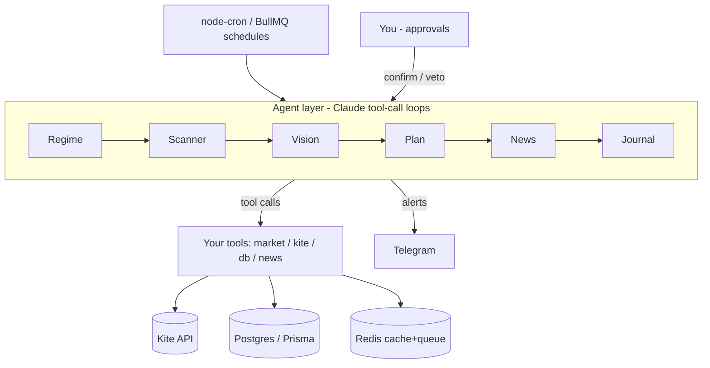

# Concepts to Master — Swing Trader + Building the App

> Two halves. **Part A** is the *trading* knowledge baked into your v5 blueprint. **Part B** is the
> *engineering + agentic* knowledge to build it. Every concept gets a plain-language explanation and
> a **"in your app"** line tying it to where it lives. A **coverage checklist** at the end maps every
> concept to its home so nothing is missed.
>
> Read Part A first if you're shaky on trading; read Part B first if you're shaky on building. They
> interlock — the app exists to execute the trading method with discipline you can't sustain by hand.

---

# PART A — Swing Trading Concepts

## A1. What swing trading is

Holding a stock for **a few days to a few weeks** to capture one "swing" in price — longer than day
trading (minutes/hours), shorter than investing (months/years). You enter on a *setup* (a repeatable
chart condition), risk a fixed small amount, and exit on a target or a stop.

**In your app:** the entire system is built around end-of-day (EOD) decisions — no minute-by-minute
screen watching. You decide in the evening, orders place in the morning.

## A2. The operating model — three stock groups, two rhythms

Your method organizes every NSE 500 stock into three buckets and runs on two clocks.

```
THREE GROUPS                                  TWO RHYTHMS
┌─ Group 1: Open positions ─┐                 WEEKLY (Sunday)
│   you hold a trade        │  ── trade ──►     scan all NSE 500 → propose watchlist adds
│   managed by EOD review   │     closes        curate watchlist (15–30 names, each a thesis)
├─ Group 2: Active watchlist┤  ◄─ entry ──
│   ~20–30 names + thesis   │     fills        DAILY (Mon–Fri)
│   scanned nightly         │                   evening: scan Group 2 → setups → confirm plans
├─ Group 3: NSE 500 universe┤                   morning: readiness check → place GTT
│   scanned Sundays only    │                   intraday: monitor news, protect stops (lean)
└───────────────────────────┘                   evening: review positions + scan again
```

**In your app:** Group membership drives behavior — the scanner ignores Group 1 (you already own it)
and Group 3 on weekdays (too big to scan nightly). This is §1 of the blueprint.

## A3. Price data — OHLCV, candles, timeframes

Each period of trading is summarized by five numbers: **O**pen, **H**igh, **L**ow, **C**lose,
**V**olume. Drawn as a **candle**: body = open→close, wicks = high/low. A **timeframe** is the period
each candle covers — you use **daily** (each candle = one day) and **weekly** (one week).

```
   high ─┐ ← upper wick
        ┌┴┐
        │ │ ← body (open→close); filled = down day, hollow = up day
        └┬┘
    low ─┘ ← lower wick
```

**In your app:** the `Candle` table stores OHLCV per timeframe; you fetch via Kite Historical API and
compute indicators on both daily and weekly series.

## A4. Reading candlesticks and chart patterns

Candle *shapes* and *sequences* carry information a single number can't:
- **Inside bar** — a candle fully inside the prior candle's range = consolidation/pause.
- **Bull flag** — sharp move up, then a tight downward drift = continuation setup.
- **Cup & handle / flat base / ascending triangle** — multi-week consolidations before breakouts.
- **Doji / hammer / engulfing** — single-candle reversal hints.

**Why charts beat line plots:** these are invisible on a line chart — you need candle bodies. This is
exactly why your Vision layer renders **candlesticks**, not lines.

**In your app:** the Vision Agent (Opus) reads a rendered candlestick PNG to confirm patterns the
scalar indicators can't see (§13).

## A5. The 10 orthogonal indicators

Each indicator answers **one distinct question**. "Orthogonal" = non-overlapping. Stacking redundant
indicators (three momentum oscillators) just produces **correlated false confidence**.

| Family | Indicator | Question it answers |
|---|---|---|
| **Trend** | EMA 20 / 50 / 200 | Which way, and is the structure stacked (20>50>200 = strong up)? |
| | ADX (+DI / −DI) | How *strong* is the trend (not direction)? ADX > 25 = trending |
| | MACD | Is momentum accelerating or fading? |
| | Supertrend | Simple up/down regime flag |
| **Momentum** | RSI (14) | Overbought/oversold; is it cooling into a buy zone? |
| | RS vs Nifty | Is the stock *outperforming the index*? (see A8) |
| **Volatility** | ATR (+ ATR%) | How much does it move per day? (sizing + stops) |
| | Bollinger Bands + BB width | Is it *compressed* (coiled before a move)? |
| **Volume** | Volume ratio (today / 20-day avg) | Is participation expanding or drying up? |
| | Delivery % | Real buying (delivery) vs intraday churn? |
| **Structure** | Swing highs/lows, support/resistance, price vs EMA | Where's the price relative to key levels; how much room? |

**In your app:** `computeAllIndicators(symbol, timeframe)` produces an `IndicatorSnapshot`; it's pure
deterministic math (no AI), run on all watchlist stocks nightly (§12).

## A6. Setup types — the repeatable conditions you trade

A *setup* is a named, rule-defined chart condition with an edge. Yours:
- **Breakout from consolidation** — price + volume break a tight range.
- **Pullback to rising EMA 20** — uptrend pauses back to support, then resumes.
- **Inside bar after a strong move** — coil → continuation.
- **Higher-high / higher-low resumption** — trend structure continues.
- **Relative-strength breakout vs Nifty** — leader breaks out while it's beating the index.

**Key idea:** different setups want *opposite* things — a breakout wants volume **expanding**; a
pullback wants volume **contracting** (dry-up). Your scoring must be setup-aware.

**In your app:** the Scanner Agent detects these; the §15 `computeIndicatorScore` uses per-setup
weight tables (the draft of your §20.5 rule specs).

## A7. Market regime — the weather around every trade

Individual setups behave differently depending on the **overall market**. Classify it: trending up /
down / sideways, using **Nifty** (the index), **India VIX** (fear gauge), and **breadth**
(advance/decline — how many stocks rise vs fall).

**Why it's load-bearing:** long swing setups have a far lower win rate in a downtrend. Trading longs
in a bear market is the #1 way swing accounts blow up.

**In your app:** the Regime Agent classifies nightly; v5 made it a **hard gate** — in `risk_off` it
**blocks new longs**, in `neutral` it halves risk and raises the entry bar (§7 Agent 1).

## A8. Relative strength (RS vs Nifty)

Is the stock beating the index? `RS = stockReturn / niftyReturn` over a window (you use ~3 months /
63 trading days). RS > 1.0 = outperforming. Leaders outperform; you want leaders.

**In your app:** `momentum.rsVsNifty` feeds both the Watchlist Score and the momentum sub-score.

## A9. The scoring stack — how a setup becomes a number

Three layered scores answer three different questions:

```
SETUP DETECTED
   │
   ├─► Indicator (Confidence) Score 0–100   "strong on the numbers?"   ← pure math, §15
   │
   ├─► Vision Score 0–100                    "clean on the chart?"      ← Opus reads PNG, §13
   │
   ▼
finalScore = (0.6·indicator + 0.4·vision) × continuous-veto-if-vision<40
   │
   ▼ (next morning)
Morning Readiness Score = finalScore − overnight penalties (gap, news, VIX)
   │
   ▼
place GTT if MR ≥ regime threshold (50 risk_on / 60 neutral)

Separately, every evening:
Watchlist Score 0–100 = 0.4·weekly-trend + 0.3·RS + 0.3·setup-proximity   "heating up?"
```

**In your app:** keep these separate — never overwrite the evening signal with the morning one; you
want to *see* what changed overnight (§15, blueprint design decision).

## A10. Entry mechanics — zones, GTT, gap check

- **Entry zone** — a price band, not a single price (e.g. ₹820–828).
- **GTT (Good-Till-Triggered)** — a resting order at the broker that fires when price hits a trigger.
- **Buy-stop vs buy-limit** — a *buy-stop* enters on a breakout *up* through a level (confirmation); a
  *buy-limit* enters on a dip *down* to support. The mechanism should match the setup.
- **Opening gap check** — if the stock opens *outside* the entry zone, cancel the order (the setup is
  no longer valid at your price).

**In your app:** GTT placed in the morning after the readiness check; 9:15 AM gap check cancels stale
entries (Workflow 2, §14). v5 flags: entry mechanism should be per-setup-type (currently one rule).

## A11. Risk core — R, position sizing, stop loss

**R** = your planned loss if the stop hits = **1R**. You risk a fixed % of equity per trade
(e.g. 0.75–1%). Position size is **derived from the stop distance**, not guessed:

```
quantity = (equity × risk%) ÷ (entry − stopLoss)

Example: ₹1,08,000 × 1% = ₹1,080 risk.  Entry 828, SL 798 → ₹30/share.
         quantity = 1,080 ÷ 30 = 36 shares.
```

**Stop loss** = the price that says "I was wrong." Types: **structural** (below a swing low),
**ATR-based** (e.g. 1.5×ATR). v5 adds guards: a **floor** (≥1.5×ATR — a too-tight stop = oversized
position shaken out by noise) and a **ceiling** (≤8% — wider isn't a swing trade).

**In your app:** the Plan Agent calls `calculate_position_size(entry, sl, risk%, capital)`; v5 added
the floor/ceiling + regime risk multiplier (§7 Agent 3).

## A12. Risk-reward (R:R) and the minimum

**R:R** = reward ÷ risk = `(target − entry) ÷ (entry − stopLoss)`. You require **≥ 1.5** on Target 1.
Below that, the math doesn't pay for your losers.

```
Entry 828, SL 798 (risk 30), T1 888 (reward 60) → R:R = 60/30 = 2.0  ✓ (≥1.5)
```

**In your app:** §20.5 rejects plans with T1 R:R < 1.5; `TradePlan.riskRewardRatio` stores the T1 R:R.

## A13. Portfolio risk — heat, correlation, concurrency, caps

One trade's risk is 1R. The **portfolio** has aggregate risk:
- **Portfolio heat** — sum of open per-trade risk as % of equity. Cap = 6% (≈ 6 trades at 1R).
- **Correlation / beta** — a caveat that breaks naive heat: in a market gap-down, correlations go to 1
  and stops gap *through* their triggers, so 8 long high-beta names are really **one leveraged bet on
  the market**. Real worst-case loss > the "independent" 6%.
- **Concurrency caps** — max 8 open positions, max 10 active setups (cognitive + operational limit).
- **Loss caps** — stop taking new risk after −3R/day, −6R/week, −10–12R/month.
- **Sector / theme caps** — max 25% in one sector; and watch *correlated themes* (Auto + ancillaries +
  tyres move together) that a sector label misses.

**In your app:** §20.2/20.3; the regime gate is your primary defense against the correlation problem —
it cuts exposure *before* the bad day.

## A14. Exit management — where the money actually is

Entries get attention; **exits decide profitability.** Your staged policy:

```
        entry
          │
   price ─┼─ +1R ──► move STOP to BREAKEVEN (now risk-free)
          │
          ├─ T1 (1.6R) ──► SELL part (e.g. 50%); resize stop on the rest
          │
          ├─ runner ──► TRAIL stop = max(last swing low, close − 2.5·ATR)
          │
          └─ no +1R in 10 sessions ──► TIME STOP (exit, free the slot)
```

- **Target** — a planned profit-taking price.
- **Partial / scaled exit** — sell a fraction at T1, let the rest run.
- **Breakeven move** — once +1R, move stop to entry; the trade can't lose anymore.
- **Trailing stop** — follows price up to lock in gains.
- **Time stop** — dead trades tie up a position slot; cut them.

**In your app:** EOD position review creates suggestions you approve (§15 Exit Policy). **Critical
interaction:** a partial exit MUST resize the stop to the remaining quantity, or the runner is
unprotected (the C1 fix).

## A15. Stop-loss execution reality (the Kite trap)

A stop only protects you if it *fills*. Kite **GTT places a LIMIT order on trigger — not a market
order.** A limit set *at* the trigger rests unfilled on a gap-down *through* it → you hold the loss.
Fix: set the SL limit **below** the trigger (buffer ≈ 2.5×ATR) so it fills through moderate gaps.
A catastrophic gap still slips — you *size* for that, you don't pretend a stop prevents it.

**The unprotected window** — between an entry fill and the SL being live, the position has no stop. If
the broker postback is missed, that window can be hours. Fix: assert SL presence every 30 minutes.

**In your app:** §14 buffered-LIMIT SL; News Agent 30-min SL-presence check (the A2/A3 fixes).

## A16. Hypothesis discipline — trading your thesis, not the noise

Two levels of written reasoning:
- **Structural (watchlist) hypothesis** — *why* a stock is worth watching for weeks (the macro/sector
  thesis).
- **Setup hypothesis** — *why this specific entry* fits the thesis, and **what would invalidate it**.

**Hypothesis integrity** — was the thesis still valid at entry? The **discipline metric** = % of losses
where the hypothesis was *not* intact at entry. That single number tells you whether you lose from bad
setups or from trading against your own conviction.

**In your app:** the UI blocks plan approval until a hypothesis exists; the Journal Agent scores
integrity (§7 Agent 3, Agent 7). This is the most valuable data the system collects.

## A17. Journaling and behavioral feedback

Every closed trade is reviewed: was the setup/entry/exit correct, was the hypothesis intact,
**mistake tags** (early entry, ignored SL, missed news), **psychological tags** (FOMO chase, revenge
trade, hesitation), and **override tracking** (did you overrule the system, and did it pay?).

**In your app:** §20.7; aggregated by regime and tag, this turns the journal into a behavioral
feedback loop, not just a log.

## A18. Liquidity and hard filters — what you refuse to trade

Before any setup counts, hard exclusions (technical signal can't override these):
- **Liquidity** — average daily turnover < ₹30 Cr → skip (you can't get out cleanly).
- **Promoter pledge > 50%** — structural blow-up risk.
- **F&O ban** — exchange restriction.
- **Corporate results < 5 days out** — event risk you can't model.
- **Index rebalancing exclusion** — forced selling pressure incoming.

**In your app:** Scanner Agent applies these as hard filters before scoring (§7 Agent 2).

## A19. Backtesting concepts — proving the edge before risking money

- **Survivorship bias** — testing on *today's* index members ignores delisted losers → results look
  better than reality. (You acknowledge this in v1.)
- **Walk-forward** — optimize on a training window, test on the *next unseen* window, slide forward.
  The honest way to avoid curve-fitting.
- **In-sample vs out-of-sample** — tuned data vs fresh data; only out-of-sample results count.
- **Costs & slippage** — brokerage, taxes, and the gap between expected and actual fill. Results
  *before* costs are fantasy.
- **Overfitting / fragility** — if a tiny parameter change swings performance a lot, the strategy is
  curve-fit, not robust.
- **Sample size** — need ≥ 100 trades before trusting a number.
- **Performance targets** — win rate 40–50%, ~2R average winner, max drawdown ≤ 10% (hard line 15%).

**In your app:** §20.4–20.8 + the Strategy Lab. The `v5-freeze-checklist.md` is your Phase-4 guide to
calibrating every seed constant against these.

## A20. Corporate actions and price adjustment

Splits, bonuses, and big dividends create artificial price jumps. **Adjusted** prices remove them so
indicators and backtests see true continuity.

**In your app:** all OHLCV used for indicators/backtests must be corporate-action-adjusted (§20.4).

## A21. News and announcements

Filings (BSE/NSE) can invalidate a setup overnight or mid-trade. You **classify** impact (high/medium/
low) and act: a material announcement is a hard veto in the morning; mid-swing results get an alert.

**In your app:** News Agent (sole intraday agent) polls every 30 min and classifies (§7 Agent 4).

## A22. Compliance and scope

- **SEBI / human-in-the-loop** — you (a human) approve every order; the agent never auto-trades
  unattended. This is both safety and regulatory fit for personal algo use.
- **Long-only (v1)** — shorts (via F&O) are out of scope until separately risk-defined and backtested.

**In your app:** every order passes a human gate (§1, §20.1).

---

# PART B — Building the App

## B0. Mental model — this is an agentic system

Your app is not a script. It's a set of **agents** (LLM-driven loops) that call **tools** (your code),
coordinated by a **harness**, persisting **state**, with a **human in the approval seat**.



The course's 22 chapters are the concept spine for this. Part B walks them in build order.

## B1. The stack (what each piece is for)

| Piece | What it is | Why it's here |
|---|---|---|
| **TypeScript** | typed JavaScript | safety across front + back |
| **Next.js (App Router)** | React + API routes in one repo | UI + backend, no separate server |
| **PostgreSQL + Prisma** | relational DB + typed ORM | trades, setups, journal — structured data |
| **Redis** | in-memory store | cache, job queue backend, counters |
| **BullMQ** | job queue on Redis | reliable scheduled scans/workers |
| **node-cron** | scheduler | fires jobs on the IST clock |
| **Kite Connect + Ticker** | broker REST + WebSocket | OHLCV, orders/GTT, live ticks, postbacks |
| **Telegram Bot API** | messaging | alerts to your phone |
| **chartjs-node-canvas** | server-side chart → PNG | renders candlesticks for Vision |
| **Claude API** | LLM (Sonnet text, Opus vision) | the agents' brains |
| **NextAuth / PM2** | single-user auth / process mgr | login + always-on deploy |

## B2. Function calling / tools — *Ch.01*

The model never touches your DB or broker. It **emits a structured request** ("call `get_ohlcv` with
these args"); **your code executes** and returns the result. The tool's **schema** describes inputs;
the **description** is the model's only guidance on when to use it. **Errors are returned as tool
results**, not thrown — the model can read an error and recover. Every `tool_use` has an `id` your
`tool_result` must echo back.

**In your app:** `get_ohlcv`, `compute_indicators`, `save_setup`, etc. — every agent capability.

## B3. The agent loop — *Ch.02*

Wrap one tool call in a loop: **Observe → Plan (call model) → Act (run tools) → Reflect (append
results) → Stop**.

```
Observe → Plan → Act → Reflect → Stop?
   ↑                              │ no
   └──────────────────────────────┘
```

Key sub-concepts: **stop conditions** (model done / `final_answer` tool / step cap / token budget);
**doom loops** (same tool + same args repeated — detect and break); **parallel dispatch** (run
read-only tools concurrently, serialize writes); **errors as turns**; and the **model-vs-code split**
(decisions under uncertainty → model; deterministic math like indicators → plain code).

**In your app:** `base-agent.ts` is this loop, shared by all agents.

## B4. Tools as contract — *Ch.03*

A production tool carries more than a schema: **metadata flags** (read_only, destructive,
concurrency_safe, idempotent, open_world) the *loop* reads; a **validation pipeline** (known → typed →
semantically safe → permitted → execute); **idempotency keys** (so a retry of `placeGTT` doesn't double
your position); a **result envelope** with a `hint` field guiding the model's next move; **clip for the
model, persist in full**; **dry-run** for destructive tools; **per-agent tool sets** (the wrong tool
isn't even on the table); the **silent-success trap** (re-read after every write).

**In your app:** `kite.placeGTT` needs idempotency + re-verify; Scanner has no order tools; the SL
re-check is the silent-success guard.

## B5. Prompts, context, and caching — *Ch.04*

Tool schemas and the system prompt sit in context **every turn**. Keep them **byte-stable** so the
provider's prompt cache hits (you pay once, not every turn). **Context packing** = deciding what to put
in front of the model (indicator snapshots into the Plan Agent) vs what to leave in the DB.

**In your app:** Vision prompt engineering; packing snapshots into Plan Agent; Redis caching market data.

## B6. Memory — short-term, long-term, writing — *Ch.05–07*

- **Short-term (Ch.05)** — context *within* a run; **compaction** when it fills.
- **Long-term recall (Ch.06)** — retrieving across history (the Journal Agent reading weeks of trades).
- **Memory writing / curation (Ch.07)** — *deciding what's worth keeping*. Your hypothesis gate is a
  memory-write decision.

**In your app:** chat widget (short-term), journal retrieval (long-term), hypothesis gate (curation).

## B7. State and persistence — *Ch.08*

Agents are stateless between runs; the **durable state** lives in Postgres/Redis. Sessions
(`KiteSession`), job timestamps, idempotency records, trade lifecycle status. Each step boundary is
where you save state so a crash/restart resumes cleanly.

**In your app:** the whole schema (§5); the Kite token surviving PM2 restarts.

## B8. Planning patterns — *Ch.09*

**Plan-then-execute**: separate *deciding what to do* from *doing it*. Your **two-stage approval**
(evening hypothesis confirm → morning GTT placement) is exactly this — the plan is made and reviewed
before any irreversible action.

**In your app:** Workflow 3; the regime gate is a plan precondition.

## B9. Multi-agent delegation — *Ch.10*

One agent **fans out** work to many workers and collects results. Your scanner scoring across many
stocks is a fan-out (and the deterministic indicator math runs as plain code, not N tool calls).

**In your app:** Sunday NSE-500 scan + weekday Group-2 scan.

## B10. The agent harness — *Ch.11*

The **harness** is the composition layer that wires agents into a pipeline: Regime → Scanner → Vision →
Briefing. It owns ordering, retries, the step boundary, and where each capability (durability,
observability, approvals) attaches.

**In your app:** the EOD scan worker and Sunday worker are harnesses.

## B11. Human-in-the-loop — *Ch.12*

Where a human approves, vetoes, or is escalated to. Approval **gates** (place GTT?), **hard vetoes**
(BSE announcement), **escalation** (SL placement failed → critical alert). The philosophical center of
your system.

**In your app:** every order gate; `open_unprotected` red banner; Telegram criticals.

## B12. Connectors, channels, IPC — *Ch.13*

How the system talks to the outside and to itself: the **Kite postback webhook** (with **checksum
verification**), **Telegram** as a channel, **BullMQ** as inter-process messaging between workers.

**In your app:** `/api/kite/postback`, Telegram alerts, the job queue.

## B13. Skills and subagents — *Ch.14*

Packaging capability as a unit: **Vision as a skill** invoked only on the shortlist; the **Plan Agent as
an on-demand subagent** per setup. Smaller, sharper units beat one giant agent.

**In your app:** Vision and Plan are invoked narrowly, not always-on.

## B14. Backend infrastructure — *Ch.15*

The Postgres + Redis + BullMQ foundation: queues, workers, caching, connection management. This *is*
Phase 1.

**In your app:** `src/jobs/`, `src/lib/`, `docker-compose.yml`.

## B15. Observability — *Ch.16*

You can't fix what you can't see. **Structured tracing** around every tool call (name, args, duration,
result, error); a **trace** per agent run. Validation failures are free signal about which tool
descriptions are unclear.

**In your app:** add spans to `base-agent.ts`; the audit-log stream in Redis.

## B16. Cost, latency, model strategy — *Ch.17*

Match the model to the job: **Sonnet** for text agents, **Opus** for vision (expensive, used only on
the shortlist). Track cost; cap it (Redis Vision counter). Latency: parallelize where safe.

**In your app:** the two-tier model choice; the Vision daily counter / cost guard.

## B17. Safety and adversarial inputs — *Ch.18*

Validate everything crossing a boundary: **checksum** on broker postbacks, **Zod** on the Vision JSON
output (with one retry), hard scanner filters, **semantic validation** (a path/identifier/limit can
parse and still be wrong). Sanitize on the way in, escape on the way out.

**In your app:** postback checksum, `VisionVerdictSchema`, the hard filters.

## B18. Operations and forward-deployed — *Ch.19*

Running it for real: **reconciliation** (catch missed postbacks), **graceful shutdown** (SIGTERM →
disconnect ticker cleanly), **holiday checks**, **loud early failures** (fail visibly, not silently).

**In your app:** 3:35 PM reconciliation, PM2 shutdown hooks, NSE holiday check.

## B19. Proactive agents — *Ch.20*

Agents that act on a **schedule or trigger**, not just on your request: cron-fired scans, 30-min news
polling, 7:30 AM token check, EOD exit suggestions. The system works while you don't watch it.

**In your app:** all the BullMQ workers + node-cron schedule.

## B20. Self-evolving agents — *Ch.21*

The system improving itself from accumulated outcomes — automatic weight/prompt adjustment. Your
**known gap**: you collect the data (hypothesis integrity, regime stats, Vision accuracy) but stop at
reporting. Phase 5 closes the loop — the Strategy Lab seed constants stop being hand-tuned.

**In your app:** Phase 5; the `v5-freeze-checklist.md` is the bridge to it.

## B21. Designing your own agent — *Ch.22*

The design canvas — read at the *end* as a retrospective: compare your finished system against the
canvas, decide what's next.

## B22. Cross-cutting engineering concepts

Not tied to one chapter, but you need all of them:
- **Async / concurrency** — `Promise.all` for parallel reads; serialize writes/orders.
- **Webhooks + signature verification** — receiving broker events securely.
- **Scheduling & timezones (IST)** — node-cron on the right clock; market hours/holidays.
- **Structured output / JSON-schema / Zod** — forcing the model to return parseable, validated data.
- **Idempotency keys** — safe retries for side-effecting calls.
- **Retries, backoff, rate limits** — Kite API has limits; batch with delays.
- **Secrets / env management** — API keys out of code (`.env.local`).
- **The data pipeline** — fetch → store → compute → score, as deterministic stages before any AI.
- **Vision input to an LLM** — sending an image (base64 PNG) + text and parsing the verdict.
- **Error handling philosophy** — errors as data the model/loop can act on, not crashes.

---

# Coverage Checklist — double-check nothing is missed

### Part A — Trading (22 concepts)

| # | Concept | Home in blueprint |
|---|---|---|
| A1 | What swing trading is | §1, philosophy |
| A2 | Three groups / two rhythms | §1 |
| A3 | OHLCV, candles, timeframes | §5 Candle, §12 |
| A4 | Candlestick + chart patterns | §13 Vision |
| A5 | 10 orthogonal indicators | §12 |
| A6 | Setup types | §7 Agent 2, §20.5 |
| A7 | Market regime (Nifty/VIX/breadth) | §7 Agent 1 |
| A8 | Relative strength | §12, §15 |
| A9 | Scoring stack (indicator/vision/final/watchlist/MR) | §15, §13 |
| A10 | Entry mechanics (zone/GTT/gap) | §14, Workflow 2 |
| A11 | R, position sizing, stop loss | §7 Agent 3, §20.2 |
| A12 | Risk-reward & min R:R | §20.5 |
| A13 | Portfolio heat, correlation, caps | §20.2, §20.3 |
| A14 | Exit management (breakeven/partial/trail/time) | §15 Exit Policy |
| A15 | Stop execution reality (Kite GTT, gaps) | §14 |
| A16 | Hypothesis discipline & integrity | §7 Agents 3/7 |
| A17 | Journaling & behavioral feedback | §20.7 |
| A18 | Liquidity & hard filters | §7 Agent 2 |
| A19 | Backtesting concepts | §20.4–20.8 |
| A20 | Corporate actions / adjustment | §20.4 |
| A21 | News & announcements | §7 Agent 4 |
| A22 | Compliance & scope (SEBI, long-only) | §1, §20.1 |

### Part B — Building (course chapters + stack + cross-cutting)

| # | Concept | Chapter |
|---|---|---|
| B0 | Agentic-system mental model | Ch.00, Ch.22 |
| B1 | The stack | §2 |
| B2 | Function calling / tools | Ch.01 |
| B3 | The agent loop | Ch.02 |
| B4 | Tools as contract | Ch.03 |
| B5 | Prompts, context, caching | Ch.04 |
| B6 | Memory (short/long/writing) | Ch.05–07 |
| B7 | State & persistence | Ch.08 |
| B8 | Planning patterns | Ch.09 |
| B9 | Multi-agent delegation | Ch.10 |
| B10 | The harness | Ch.11 |
| B11 | Human-in-the-loop | Ch.12 |
| B12 | Connectors / channels / IPC | Ch.13 |
| B13 | Skills & subagents | Ch.14 |
| B14 | Backend infrastructure | Ch.15 |
| B15 | Observability | Ch.16 |
| B16 | Cost / latency / model strategy | Ch.17 |
| B17 | Safety & adversarial inputs | Ch.18 |
| B18 | Operations & forward-deployed | Ch.19 |
| B19 | Proactive agents | Ch.20 |
| B20 | Self-evolving agents | Ch.21 |
| B21 | Design canvas | Ch.22 |
| B22 | Cross-cutting engineering (10 items) | — |

**Every chapter Ch.00–Ch.22 is covered. Every blueprint section §1–§20 maps to at least one trading
concept. The 10 cross-cutting engineering concepts fill the gaps the chapters don't name explicitly.**

---

## Suggested learning order

1. **A1–A5** (what you're trading) + **B0–B3** (what you're building) — the foundations.
2. Then follow `swing-trader-chapter-phase-map.md` — it sequences the Part-B chapters into the four
   build phases, with the matching trading concepts arriving exactly when you need them.
3. Keep this file as the **glossary**; keep the phase map as the **schedule**; keep
   `v5-freeze-checklist.md` for when you reach Phase 4 calibration.
