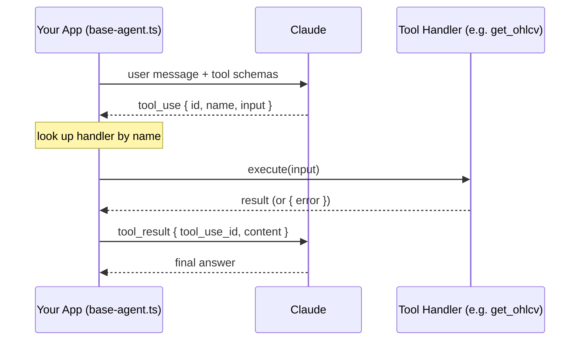

# Course Takeaways — Swing Trader AI

---

## Ch.01 — Function Calling

**The model requests; your code executes. Always.**
The model emits a structured JSON block naming the function and arguments. Your dispatch loop (`base-agent.ts`) looks up the handler, runs it, and returns the result as a `tool_result` message. The model never touches Kite, Postgres, or Redis.

**The four-step cycle:**

**Description = the model's only guidance.**
Write what the tool does, when to call it, and — critically — when *not* to. Vague descriptions cause wrong-time calls.

**Schema and handler are one unit.**
Rename a field in your TypeScript handler? Update the schema in the same commit. Schema drift is the most common silent failure — the model sends the old field name, your handler gets `undefined`, nothing crashes loudly.

**Errors are tool results, not exceptions.**
Wrap every handler so failures return `{ error: "..." }` as a `tool_result`. The model can read an error and recover. It cannot recover from a crashed process.

**The `id` round-trip is mandatory.**
Every `tool_use` block has an `id`. Your `tool_result` must reference the same `id`. Lose it and the conversation breaks silently.

**Large results kill your context.**
Don't return 50 KB inline. Send a summary + pointer; stash the full result elsewhere.

**Ch.01 milestone for Swing Trader:**
Write the `get_ohlcv` tool definition (schema + description), wrap the Kite call in an error-catching handler, make one Claude call that uses it. That single round-trip is Ch.01 done.
