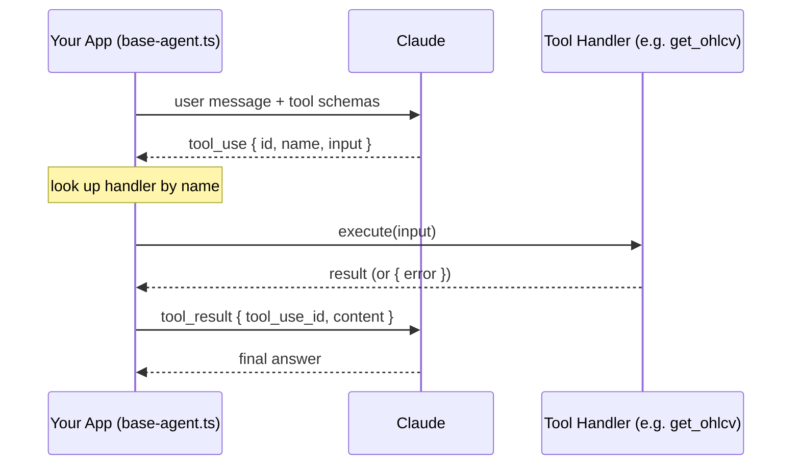

# Course Takeaways — Swing Trader AI

---

## Ch.01 — Function Calling

**The model requests; your code executes. Always.**
The model emits a structured JSON block naming the function and arguments. Your dispatch loop (`base-agent.ts`) looks up the handler, runs it, and returns the result as a `tool_result` message. The model never touches Kite, Postgres, or Redis.

**The four-step cycle:**



**Description = the model's only guidance.**
Write what the tool does, when to call it, and — critically — when *not* to. Vague descriptions cause wrong-time calls.

**Schema and handler are one unit.**
Rename a field in your TypeScript handler? Update the schema in the same commit. Schema drift is the most common silent failure — the model sends the old field name, your handler gets `undefined`, nothing crashes loudly.

**Errors are tool results, not exceptions.**
Wrap every handler so failures return `{ error: "..." }` as a `tool_result`. The model can read an error and recover. It cannot recover from a crashed process.

**The `id` round-trip is mandatory.**
Every `tool_use` block has an `id`. Your `tool_result` must reference the same `id`. Lose it and the conversation breaks silently.

**Large results kill your context.**
Don't return 50 KB inline. Send a summary + pointer; stash the full result elsewhere.

**Ch.01 milestone for Swing Trader:**
Write the `get_ohlcv` tool definition (schema + description), wrap the Kite call in an error-catching handler, make one Claude call that uses it. That single round-trip is Ch.01 done.

---

## Ch.02 — The Agent Loop

**Ch.01 was one tool call. Ch.02 wraps it in a loop.**
The model emits a tool request → your code runs it → result goes back → model decides again. Repeat until a stop condition fires.

**The five stages:**

```
Observe → Plan → Act → Reflect → Stop
  ↑                                 │
  └─────────── (if no stop) ────────┘
```

| Stage | What happens | In your code |
|---|---|---|
| Observe | Assemble messages array | `messages` built before `create()` |
| Plan | Call model | `claude.messages.create()` |
| Act | Dispatch tool calls | `handler(block.input)` |
| Reflect | Append tool results | `messages.push({ role: "user", content: toolResults })` |
| Stop | Check stop conditions | `stop_reason === "end_turn"` |

**Stop conditions are a spectrum — layer all of them:**

| Condition | Type | Notes |
|---|---|---|
| `stop_reason === "end_turn"` | Primary | Model considers itself done |
| `final_answer` tool | Intentional finish | Forces explicit close; gives clean loggable output |
| Grace call | Soft cap | Last-turn warning in system prompt; model closes cleanly |
| Step cap (`maxIterations`) | Hard safety net | If loop ends here regularly, something is wrong upstream |
| Token / cost budget | Hard safety net | Return partial result, label it |

**The loop carries more than messages:**
- Tokens spent (for budget checks)
- Step count (for cap)
- Recent tool call history (for doom loop detection)
- Abort token (for cancellation)
- System prompt kept byte-stable (for cache hits → Ch.04)

**Three choices at every step — not two:**
Continue → Stop → **Compact** (shrink context, then continue). Compaction is triggered when context fills; mechanics in Ch.05.

**Errors are turns, not exceptions:**
When a tool fails or handler is missing, append `{ error: "..." }` as `tool_result` and keep looping. Model reads the error and self-corrects. Throwing an exception out of the loop is almost never right.

```typescript
// Wrong — crashes the loop
if (!handler) throw new Error(`No handler for ${block.name}`);

// Right — model can recover
toolResults.push({
  type: "tool_result",
  tool_use_id: block.id,
  content: JSON.stringify({ error: `Tool '${block.name}' not available` }),
  is_error: true,
});
```

**Doom loop — the most common runaway:**
Model calls same tool + same args 3× in a row. Gets same useless result. Never notices. Fix: byte-for-byte equality check on last 3 calls.

```typescript
const key = `${block.name}:${JSON.stringify(block.input)}`;
recentCalls.push(key);
if (recentCalls.length >= 3 && recentCalls.slice(-3).every(k => k === key)) {
  throw new Error(`Doom loop detected: ${block.name}`);
}
```

**Parallel tool calls — run safe tools concurrently:**
Independent read-only tools (e.g. `fetch_bse_announcements` × 3 symbol groups) should run in parallel. Write/send/pay tools serialize. Cuts wall-clock latency substantially for News Agent.

**Step boundary = where production capabilities attach:**

```
Act → [ BOUNDARY ] → Reflect
         │
         ├── Durability: save state (Ch.08)
         ├── Observability: emit trace (Ch.16)
         ├── Permission checks: gate before dispatch (Ch.03, Ch.12)
         ├── Human approvals: pause and wait (Ch.12)
         └── Context compression: clip oversized results (Ch.05)
```

Your two-stage approval (evening hypothesis confirm → morning GTT placement) is exactly this: a human approval gate at the step boundary before `kite.placeGTT` is dispatched.

**Model = decisions under uncertainty. Code = deterministic computation.**
Never use a tool call where a function call suffices. `computeAllIndicators()` runs on all 500 stocks every evening with no model input — it's a function. `save_setup()` is called only when the model decides a setup is valid — it's a tool.

**Ch.02 gaps in your current `base-agent.ts`:**
1. No `final_answer` tool — no intentional finish signal
2. No grace call — hard cap cuts Plan Agent mid-hypothesis
3. No doom loop detection — Scanner Agent is highest-risk candidate
4. Serial tool dispatch — News Agent's 3 announcement fetches should be parallel
5. Missing handler throws instead of returning `is_error: true` as a turn

**Ch.02 milestone for Swing Trader:**
Update `base-agent.ts`: add `final_answer` tool, grace call, doom loop detection, parallel dispatch for safe tools, and error-as-turn for missing handlers.

---

## Ch.03 — Tools the Agent Can Trust

**Two audiences for every tool — model and loop.**
Model sees: schema + description. Loop sees: metadata flags + validation pipeline + result envelope. Design for both.

**The validation pipeline — cheap checks first:**

```
Known → Typed → Semantically safe → Permitted → Execute
  ↓         ↓            ↓               ↓           ↓
fatal    recoverable   recoverable      fatal     recoverable
```

Never check permissions before parsing. Never run semantic checks after the handler runs. Order is the contract.

**Tool metadata flags — loop reads, model never sees:**

| Flag | What it enables |
|---|---|
| `read_only` | Eligible for restricted-mode agents (e.g. Briefing Agent) |
| `destructive` | Triggers human approval gate before dispatch |
| `concurrency_safe` | Eligible for `Promise.all` parallel dispatch |
| `idempotent` | Loop can auto-retry on transient failure |
| `open_world` | Never cache result — changes between calls |

**Semantic validation > schema validation.**
`../../etc/passwd` parses as a valid string. `limit: 100000` parses as a valid integer. Both are wrong. Path checks need `realpath` (follow symlinks); URL checks need post-redirect resolution; identifier checks need domain lookup. String-form checks are always incomplete.

**Sanitize in, escape out — never invert.**
Strip null bytes, broken unicode, ANSI escapes *before* schema parsing. Escape for target (shell, SQL, template) *after* your handler returns. Wrong order = injection surface.

**Dry-run = destructive tool's preview mode.**
Build `dry_run?: true` into any tool that mutates. Returns what *would* happen without doing it. Gives you: approval UI, model self-check, test scaffold. Reads never need it.

**Result envelope + hint field:**

```typescript
// Failure shape — hint is the secret weapon
{ ok: false, recoverable: true, code: "NOT_FOUND",
  message: "Symbol RELIANCEE not found",
  hint: "Use NSE: prefix, e.g. NSE:RELIANCE" }
```

Bare error → model guesses and loops. Hint → model self-corrects in one turn. Costs nothing to add.

**Idempotency key = hash of (tool + args + scope).**
Reads: naturally idempotent, no key needed. Writes/sends/orders: always key. Scope = `turn_id` so deliberate repeats at a different turn produce a different key (don't hit cache). If downstream API has its own idempotency header (Stripe, modern REST), thread it through — let them be source of truth.

**Clip for model, persist in full.**
Message array = display surface, not storage surface. OHLCV for 500 stocks ≈ 150KB — send summary + DB ref to model; full candles stay in Candle table. When you clip, say so: `...[120KB clipped; full result at ref]...`. Silent clipping teaches the model a false view.

**Silent success trap — re-read after every write.**
Tool returning `"ok"` proves nothing. Re-fetch the resource inside the tool and put the proof in the result metadata. `kite.placeGTT` → re-fetch GTT status from Kite → include `status: "active"` in result. Catches silent drops before the model assumes success and moves on.

**Hooks bracket every dispatch — wire seams early:**

```
pre_tool_call → [ handler ] → post_tool_call
     │                              │
     ├── sanitize + inject defaults  ├── strip ANSI, attach metadata
     ├── permission check           ├── redact PII
     └── emit span start            └── emit span end + cost log
```

Pre-hooks: registration order. Post-hooks: reverse order (like middleware).

**Validation failures are free eval data.**
Log every recoverable error: tool name, stage, model-emitted args, error code. Pattern of failures reveals description gaps — model consistently sending `RELIANCE` instead of `NSE:RELIANCE` is a *description* failure, not a model failure. Fix the description, not the model.

**Fewer tools = sharper reasoning.**
Wrong tool should not be on the table. Scanner Agent has no order tools → cannot place orders by accident. Per-agent tool sets also shrink the permission and validation surface.

**Ch.03 gaps in your current system:**
1. No metadata flags on tools — loop can't drive parallel dispatch or approval gates
2. No semantic validation — `save_trade_plan` accepts any stopLoss/entryPrice/R:R
3. No idempotency on `kite.placeGTT` — double retry = double position, real money risk
4. No result envelope — raw throws instead of `{ok, recoverable, code, hint}`
5. No dry-run on destructive tools — approval UI has no preview to show
6. No silent-success verification after GTT placement

**Ch.03 milestone for Swing Trader:**
Add metadata flags to all tools. Wire semantic checks for `cancel_entry_gtt`, `save_trade_plan`, `get_ohlcv`. Add Redis idempotency key to `kite.placeGTT`. Wrap all tool errors in result envelope with hint. Add `dry_run` to both GTT tools. Re-fetch GTT status inside `place_entry_gtt` handler before returning success.

---

## Ch.08 — State and Persistence

**The question this chapter answers: what survives when the process dies mid-work?**
Your app runs long scans, sleeps overnight between evening and morning, and places real orders. So "what survives a crash, deploy, or laptop sleep" is load-bearing — a lost piece of state means redone work or, worse, a duplicated order.

**State inventory — list what's in RAM, decide persist-or-lose per item:**

| Runtime state | Policy for Swing Trader |
|---|---|
| Message array (full transcript) | Append-only on disk, source of truth |
| Working memory (watchlist scores, open positions, today's regime) | Snapshot to disk every step |
| Abort token (in-memory stop signal) | **Cannot survive restart** — persist a cancel *intent* instead, or a crashed scan resumes running |
| Prompt fingerprint (SHA of system prompt) | Round-trip to disk byte-identical → keeps Opus Vision cache warm across restart (Ch.04) |
| Cost/token ledger | Persist if spend caps must hold across restarts |

No defaults — pick a policy per item, write it down.

**Step-boundary commit — write to disk after each step, before the next.**
A step = one loop iteration (model → tool → reflect). Flush message + tool status + working memory before yielding. Scanner crashes at stock 247 of the Sunday NSE-500 scan → resumes at 247, not 1. Saves 246 stocks of Vision/scoring work and Opus spend.

**Run state machine — one explicit `status` column per run.**
A run = one unit of work (trigger → answer). Track it with named states, not scattered booleans:

```
queued → running → waiting_approval → running → completed
                 ↘ scheduled_retry / failed / cancelled
```

Every state-dependent change is a *guarded* DB update (`UPDATE ... WHERE status = expected`). Most "order placed twice" bugs are implicit transitions. Your two-stage approval IS this machine: evening hypothesis → `waiting_approval` → confirm → `running`; morning GTT → `waiting_approval` → approve → place. Persisting `waiting_approval` is what makes the overnight gap survive a deploy. Terminal states never revive — a failed run spawns a *new* run with `parent_run_id`.

**Crash recovery vs Resume vs Resume button — three distinct gaps:**

| Situation | Meaning | Handling |
|---|---|---|
| Crash recovery | Same intent, new process, seconds later | Continue silently *for safe-to-replay work only* |
| Resume | Same session, hours later | World moved on — re-validate, don't blind-replay |
| Resume button | User clicks continue, knows there was a gap | Free to show state + ask confirmation |

Your evening→morning workflow is **Resume**, not crash recovery. Overnight the index gaps, news drops, regime flips. So morning must NOT blindly fire last night's approved order — re-run Regime gate, Vision veto, News 30-min SL check first. Ch.08 is *why* that re-validation is mandatory: after a time gap, replay is unsafe.

**In-flight tool call — the catastrophic case for you.**
Worst crash timing: tool call started, result never returned, process died. Did the Kite order land? Four options, best→worst:
1. Read-only / `idempotent` (Scanner, Vision, News) → replay, same result.
2. Has idempotency key (Kite order `tag`) → replay with same key, downstream de-dupes.
3. Wrote to an outbox first → reconcile on restart.
4. Not safe to replay → **stop, ask the human.** Never silent retry.

GTT placement is option 2+3. Blind retry = double position; blind skip = no stop-loss. Before any retry, **reconcile**: query Kite's order book by tag to see if it already landed.

**Outbox pattern — separate "decided" from "delivered" for money-touching calls.**
Three moves around `place_entry_gtt` / SL-modify: (1) write intent row + key to a durable table, (2) call Kite, (3) mark intent fulfilled. On restart: fulfilled → skip; unfulfilled → retry-with-same-key or reconcile against Kite. Decouples durability of the *decision* from durability of the *delivery across a network you don't control*.

**CAS atomic claim — stop two workers running the same scan twice.**

```sql
UPDATE runs SET status='running', claimed_by=:worker
 WHERE id=:id AND status='queued' RETURNING *;
```

Zero rows changed → another worker won, back off. One row → you own it. Guards your Sunday + Mon–Fri scheduled scans against overlapping deploys/retries. One column + WHERE clause; wire it day one even single-process — retrofitting costs far more.

**Heartbeat + reaper — recover work from a dead worker.**
Claimed run writes `last_heartbeat_at` every few seconds. Reaper scans for `lease_expires_at < now()`, confirms the OS PID is actually dead, then re-queues the orphan. Without it, a worker that dies mid-NSE-500-scan leaves the run stuck `running` forever. Tune lease > your longest scan.

**Append-only log + per-step snapshot — use both.**
Audit log (Journal Agent transcript) = append-only, full history. Working memory + checkpoint = per-step snapshot, small and fast to resume. Standard production combo; gives audit story and resume story without duplicating either.

**Store choice — SQLite + WAL.**
Single-user, single-process → SQLite with WAL mode. Just a file: easy backup, easy inspect, runs real loads (Hermes, OpenCode). Move to Postgres only if you go multi-tenant; a workflow engine only for distributed replay-safe workflows. Neither applies to you yet.

**Session rotation as a resume primitive.**
When compaction isn't enough (Ch.05), a failed long session spawns a child session with `parent_session_id` + a handoff summary. Cache warms fresh, audit chain stays intact. Never delete a parent because a child resumed it — archive/supersede. Resume, audit, rollback all depend on the chain.

**Operate the store — backup, restore, migration.**
Daily `VACUUM INTO` SQLite snapshot minimum. Restore only *consistent* snapshots, and honor deletion markers (don't resurrect data you committed to delete). Default to additive migrations; stamp each checkpoint with its `schema_version` so resume can coerce old checkpoints forward or fail loud. Drain in-flight runs before any destructive migration.

**Ch.08 gaps in your current system:**
1. Approval state likely in-memory — overnight evening→morning gap won't survive a restart/deploy
2. No outbox + Kite order-book reconciliation around `place_entry_gtt` / SL-modify — crash mid-placement can't tell landed-vs-not
3. No run `status` state machine with guarded transitions — implicit transitions risk double-placement
4. No step-boundary commit on the NSE-500 scan — crash restarts the whole 500-stock sweep
5. No CAS claim or heartbeat/reaper on scheduled scans — overlap risk + stuck `running` on worker death
6. Morning workflow must be coded as **Resume** (re-validate), not crash recovery (blind replay)
7. Prompt fingerprint not persisted byte-identical — Opus Vision cache lost on every restart

**Ch.08 milestone for Swing Trader:**
Move the run to an explicit SQLite `status` state machine with guarded `UPDATE ... WHERE status=` transitions, persisting `waiting_approval` so the overnight gap survives. Wrap `place_entry_gtt` and SL-modify in the outbox pattern with Kite order-book reconciliation on resume. Add step-boundary commits to the NSE-500 scan. Code the morning workflow as Resume (Regime + Vision + News re-validation before firing). Wire CAS claim + heartbeat/reaper on the scheduled scans. Persist the prompt fingerprint byte-identical for warm Opus cache.

---

## Ch.15 — Backend Infrastructure

**Read this chapter through a filter: it's about scaling to MANY users on MANY machines. You are single-user, single-machine.** Most of it (multi-tenant isolation, load balancing, sticky sessions, distributed queues, 10/100/1000-server scaling, per-tenant rate limits, operator UI, Vault) is over-build for you — course is opinionated against premature complexity. The takeaways below keep only what applies at n=1, and call out what to skip.

**Core model — never run the agent inside the HTTP request.**
Web request = milliseconds. Agent run = minutes/hours/overnight. The fix for client-timeout, duplicate-execution, no-visibility is not a longer timeout — it's a different architecture: **accept work → enqueue → stream progress → checkpoint → idempotent side effects.** Your Sunday scan and overnight approval already outlive any request, so this shape fits you even with one user.

**Enqueue, stream, finish — the one pattern you must adopt:**
- API handler **never calls Claude.** It writes a run row (`status=queued`), enqueues, returns 202 in <100ms.
- Worker claims via CAS (Ch.08), transitions to `running`, runs the Ch.11 harness, checkpoints each step boundary, emits events.
- Streaming to the UI is decoupled from the worker via an event bus, so progress survives a client disconnect/reconnect.

Your triggers ("run Sunday scan", "place morning GTTs") write a queued row and return immediately — UI stays responsive while a 500-stock scan grinds for minutes.

**Heartbeat scheduler — this IS your cron.**
One process wakes every N seconds, queries for due work, enqueues it:

```sql
SELECT id FROM runs WHERE status='scheduled' AND wake_at <= now() LIMIT 100;
```

Your Sunday NSE-500 scan + Mon–Fri Group-2 scan = `scheduled` rows with `wake_at`. Same tick also runs the Ch.08 reaper and Ch.07 curator. **The scheduler must be a singleton** — two schedulers = double dispatch = double scan. Elect a leader via the CAS `service_locks` row from Ch.08 (only matters once you run >1 process; single-process today is fine).

**Queue/worker shape — SQLite atomic UPDATE.**
The chapter's own table is explicit: single machine + single tenant → SQLite atomic `UPDATE`. Do not reach for Redis Streams / NATS / Postgres / Temporal — all over-build. Worker loop is uniform regardless of backend: claim atomically → run harness → terminal status → ack; bounded retries → dead-letter on failure. Tune worker count to the **model provider's rate limit, not CPU** — the loop is I/O-bound on the Claude API.

**Outbox at scale — at-least-once is realistic, effectively-once is the goal.**
Same outbox as Ch.08, sharpened: checkpoint + outbox row commit in **one transaction**. You cannot get true exactly-once across a network — the worker can die between the Kite order landing and the marker being written, and no protocol prevents that. What you build instead: the dispatcher may retry, and **Kite dedupes by your order `tag`** so the observed effect is one order. If a downstream doesn't honor idempotency keys, keep your own dedup table and look up before dispatch. This is the money-call protection for `place_entry_gtt` / SL-modify. Monitor outbox depth — a backlog means downstream (Kite) is slower than your throughput.

**Cost ledger — operational even at n=1 because Opus Vision is pricey.**
Record per-run cost (tokens in/out, by model) as each run terminates. Lets you see "this Sunday scan cost $X in Vision." Budget gate: before a run, check remaining self-set cap; refuse if it would exceed. Ledger is durable (Ch.08) so log compaction never loses cost data. Pair with the Ch.16 trace pipeline.

**Single-user assumptions that break later — fix two now because they're cheap:**
- **In-process scheduler** — each server running its own `setInterval` double-dispatches if you ever run a second process. Elect a singleton via CAS.
- **Module-level globals** — a singleton tool registry / session state lands as a bug the moment you split gateway from worker. Pass a per-request context instead of reaching for a global.
(The rest — file-based sessions past a few thousand, in-process caches, sequential channel dispatch — don't bite a single user yet.)

**Backups — your trade history and open positions are precious.**
Scheduled `VACUUM INTO` SQLite snapshot, **daily minimum**, copy the file out. Rehearse a restore once *before* an incident, not during. Migrations are forward-only and additive (new columns with defaults).

**Storage tiers — light version:**
- **Hot** (SQLite): run table, recent OHLCV, open positions. Sub-100ms.
- **Warm** (disk / object store): oversized artifacts — full 500-stock candle dumps, Vision chart images. Keep a ref in the message (Ch.03 clip-and-stash).
- **Cold**: not needed at your scale.
Plus a non-durable cache (in-process or Redis) for rate-limit buckets, session metadata, the Ch.04 prompt fingerprint. Treat cache misses as normal.

**Provider rate-limit cascade — the only rate limiting you need.**
Skip per-tenant admission control. Keep only the model-call-site cascade: on Claude 429, rotate API keys / fall back to a smaller model (Ch.17 owns routing). Surface *"waiting for rate limit"* as a first-class run state in the stream, not a silent retry.

**What to SKIP outright (over-build for a personal app):**
multi-tenant isolation (row scoping, per-tenant DB/compute), load balancing, sticky sessions, hash-by-tenant, distributed queues (Kafka/Redis Streams/NATS), 10/100/1000-server horizontal scaling, per-tenant rate limits + admission control, full operator UI / approval queue across tenants, Vault / secret manager (env var or OS keychain is enough for your Kite + Anthropic keys).

**Ch.15 gaps in your current system:**
1. Likely calling the agent loop inside the request path — long scan will time out the client; move to enqueue→worker→stream
2. No durable run queue — adopt the SQLite atomic-UPDATE queue with CAS claim
3. Cron not modeled as a singleton heartbeat scheduler over `scheduled` rows — risk of double dispatch if a second process ever runs
4. No per-run cost ledger — Opus Vision spend is invisible and uncapped
5. No event bus / SSE stream — UI shows a spinner instead of scan progress, tool calls, approvals
6. No scheduled SQLite backup + restore rehearsal for trade/position data

**Ch.15 milestone for Swing Trader:**
Move the agent loop out of the request path: API writes a `queued` run row + enqueues + returns 202; a worker claims via CAS and runs the harness, checkpointing and emitting events per step. Model the Sunday + Mon–Fri scans as `scheduled` rows drained by a singleton heartbeat scheduler (same tick runs reaper + curator). Add a durable per-run cost ledger with a self-set budget gate. Stream run events to the UI via SSE. Keep the outbox + Kite-tag dedup around money calls. Schedule daily `VACUUM INTO` backups and rehearse one restore. Stay on SQLite — skip every multi-tenant / multi-machine layer until a second user exists.
